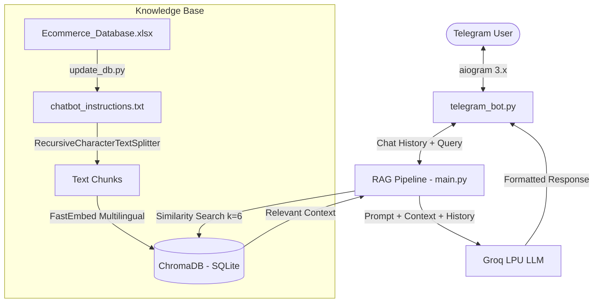

# 📚 AI-Powered Telegram Bookstore Assistant (RAG Agent)

[](https://www.python.org/)
[](https://www.langchain.com/)
[](https://www.trychroma.com/)
[](https://groq.com/)
[](https://aiogram.dev/)

An intelligent, production-ready AI Sales Agent and Customer Support Chatbot connected to **Telegram**, tailored for a modern bookstore located in **Sadat City**.

The bot leverages **Retrieval-Augmented Generation (RAG)** to provide accurate, hallucination-free answers about book catalogs, inventory, pricing, direct purchase links, working hours, return policies, and order closing protocols.

---

## 🌟 Key Features

- **⚡ Blazing Fast AI Inference:** Powered by **Groq Cloud** (`qwen/qwen3.8-27b`), delivering sub-second response times in Arabic and English.
- **🔍 Semantic Vector Search (RAG):** Built with **ChromaDB**, storing vectorized embeddings locally inside an embedded SQLite database (`chroma.sqlite3`).
- **🌐 Multilingual Embedding Engine:** Employs **FastEmbed** with `sentence-transformers/paraphrase-multilingual-MiniLM-L12-v2` (ONNX runtime) to natively handle Egyptian dialect, Modern Standard Arabic, and English without requiring GPU resources or API costs.
- **📊 Automated Excel Inventory Ingestion:** Reads product catalogs and inventory directly from `Ecommerce_Database.xlsx` across 23+ categories with live product URLs and prices.
- **💬 Conversational Memory:** Maintains per-user sliding window conversation history, enabling natural follow-up questions and multi-turn dialogues.
- **🛒 Order Closing Protocol:** Autonomously collects order details, shipping information inside Sadat City, calculates total amounts, and generates order confirmation messages without human intervention.
- **🤖 Modern Telegram Experience:** Built with **aiogram 3.x**, featuring dynamic typing indicators (`ChatAction.TYPING`), markdown message rendering, and safe fallbacks.

---

## 🏗️ Architecture & Pipeline



---

## 📁 Project Structure

```bash
Chat_bot/
│
├── .env                          # Secret environment variables (Bot Token, API keys)
├── .env.example                  # Template configuration file
├── .gitignore                    # Git ignore file for secrets and environments
├── requirements.txt              # Project dependencies
├── README.md                     # Project documentation
│
├── Ecommerce_Database.xlsx       # Source catalog (Orders, Customers, Products, Employees)
├── Chatbot_Instructions_Complete.pdf # Original bookstore policy & guidelines PDF
├── chatbot_instructions.txt      # Clean, bilingual knowledge base with all 50 products
│
├── update_db.py                  # Script to parse Excel and rebuild ChromaDB vector store
├── main.py                       # Core LangChain RAG chain and test runner
├── telegram_bot.py               # Asynchronous Telegram bot server (aiogram 3)
│
└── chroma_db_v2/                 # Persistent local SQLite vector database
    ├── chroma.sqlite3            # SQLite database file containing metadata & vectors
    └── ...                       # Vector index files
```

---

## 🛠️ Tech Stack & Libraries

| Component | Technology | Description |
|---|---|---|
| **Bot Framework** | `aiogram 3.x` | Modern, asynchronous Telegram Bot API framework |
| **LLM Provider** | `Groq` / `langchain-groq` | Ultra-fast LPU inference (`qwen/qwen3.8-27b`) |
| **Orchestration** | `LangChain 1.x` | RAG pipeline, prompt templates, and chains |
| **Vector Store** | `langchain-chroma` | Persistent local vector store backed by SQLite |
| **Embeddings** | `fastembed` | Lightweight ONNX-based multilingual embeddings |
| **Data Processing** | `pandas`, `openpyxl` | Ingestion and transformation of Excel catalogs |
| **PDF Extraction** | `pypdf`, `pymupdf` | Reading store guidelines and documentation |

---

## ⚙️ Installation & Setup

### 1. Prerequisites
- Python **3.11** or higher.
- A Telegram Bot Token from [@BotFather](https://t.me/BotFather).
- A free API Key from [Groq Console](https://console.groq.com/keys).

### 2. Clone & Install Dependencies
```powershell
# Clone the repository
git clone https://github.com/omaaar91/Chat_bot.git
cd Chat_bot

# Install required packages
py -3.11 -m pip install -r requirements.txt
```

### 3. Environment Configuration
Create a `.env` file in the root directory (or copy from `.env.example`):

```env
# Telegram Bot Token from @BotFather
TELEGRAM_BOT_TOKEN="your_telegram_bot_token_here"

# Groq API Key
GROQ_API_KEY="your_groq_api_key_here"

# Model Selection
GROQ_MODEL="qwen/qwen3.8-27b"
```

---

## 🚀 Usage

### 1. Rebuild / Update Vector Database (Optional)
If you update `Ecommerce_Database.xlsx` with new products or prices, run:
```powershell
py -3.11 update_db.py
```
This automatically parses the sheets, updates `chatbot_instructions.txt`, and syncs `chroma_db_v2/chroma.sqlite3`.

### 2. Test RAG Pipeline from CLI
To verify responses locally in the console:
```powershell
py -3.11 main.py
```

### 3. Launch the Telegram Bot
To run the live bot:
```powershell
py -3.11 telegram_bot.py
```

---

## 💬 Sample User Queries

| User Query | Bot Response Coverage |
|---|---|
| *"المكان بتاعكو فين ومواعيد العمل ايه؟"* | States Sadat City location, daily hours (9 AM - 10 PM), and delivery policy. |
| *"اي الاقسام عندكو ؟"* | Lists all 23 store categories (Music, Poetry, Fiction, History, Philosophy, etc.). |
| *"اي كتب الموسيقى عندكو ؟"* | Recommends *How Music Works*, *Rip it Up and Start Again* with prices and links. |
| *"سياسة الاسترجاع والاستبدال ايه؟"* | Explains the 14-day window, original condition rule, and representative pickup. |
| *"عايز اشتري كتاب"* | Initiates the Order Closing Protocol step-by-step. |

---

## 📄 License
This project is open-source and available under the [MIT License](LICENSE).